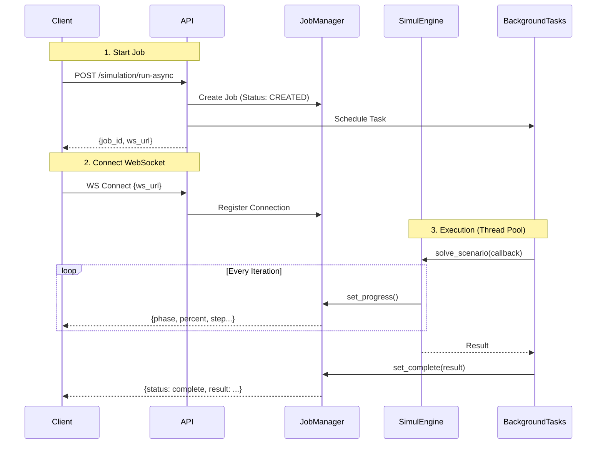

# Thermal Bridge Simulator API

REST API key features:
- **Scenario Management**: Validate and manage simulation scenarios
- **Sync Simulation**: Direct simulation execution (for short runs)
- **Async Simulation**: Background job execution with WebSocket progress updates
- **Material Registry**: Access to the material database

## Architecture

### Async Simulation & WebSockets

Long-running simulations use an asynchronous job pattern to keep the UI responsive and provide real-time feedback.



**Key Components:**
- **JobManager** (`api/jobs.py`): In-memory singleton that tracks job state and holds active WebSocket connections. It bridges the thread-bound simulation engine and the async event loop.
- **BackgroundTasks**: FastAPI's mechanism for running tasks after the response is sent. We use `asyncio.run_in_executor` to run the CPU-bound `solve_scenario` in a thread pool to avoid blocking the main event loop.

## Usage

### Run Locally
```bash
uvicorn api.main:app --reload --port 8000
```
Open [http://localhost:8000/docs](http://localhost:8000/docs) for the interactive Swagger UI.

### Common Workflows

#### 1. Validate Scenario
```bash
POST /api/scenarios/validate
{ "yaml_content": "..." }
```

#### 2. Run Async Simulation (Recommended)
1. **Start Job**:
   ```bash
   POST /api/simulation/run-async
   { "scenario": { ... } }
   # Returns: { "job_id": "...", "ws_url": "/api/ws/simulation/..." }
   ```
2. **Connect WebSocket**:
   Connect to `ws://localhost:8000/api/ws/simulation/{job_id}`.
   You will receive JSON messages for progress and final result.

## Directory Structure
- `api/main.py`: App entry point and configuration
- `api/routes/`: Route handlers (scenarios, simulation, websocket)
- `api/models.py`: Pydantic schemas for Request/Response
- `api/jobs.py`: Job manager logic
